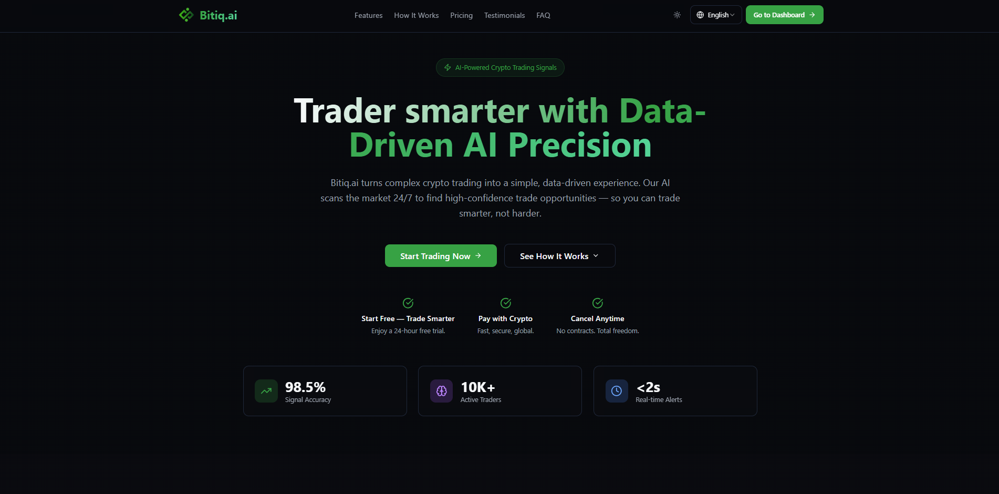
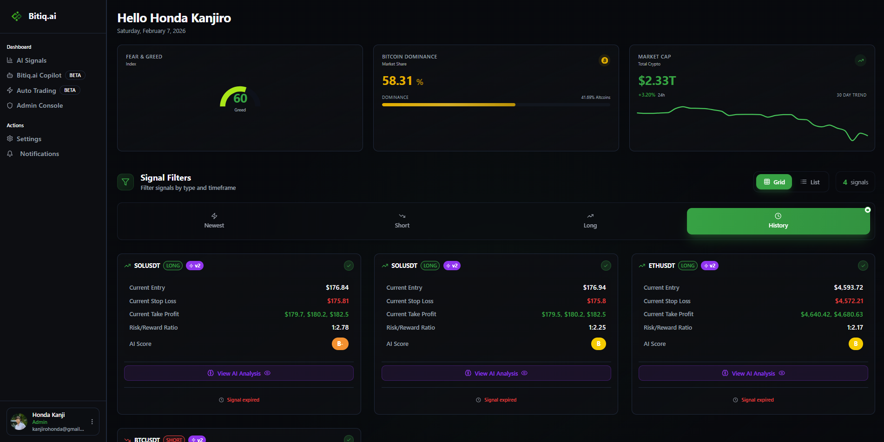

# 🧭 Bitiq Frontend [P-666]

A modern web app for the Bitiq trading and signals platform—subscription, auto-trading, copilot, admin CMS, and user account management in one responsive UI.

---

## 📚 Table of Contents

[About](#-about) · [Features](#-features) · [Tech Stack](#-tech-stack) · [Installation](#-installation) · [Usage](#-usage) · [Configuration](#-configuration) · [Screenshots](#-screenshots) · [API Documentation](#-api-documentation) · [Contact](#-contact)

---

## 🧩 About

This frontend provides the main user interface for Bitiq: landing, trading signals, auto-trading, Bitiq Copilot, subscription flows, documentation, blog, and an admin dashboard. It connects to a backend API and Supabase for auth and data, with optional Firebase for push notifications.

---

## ✨ Features

- **Landing & marketing** – Public landing, how it works, pricing, testimonials
- **Trading signals** – View and manage trading signals with quality scores
- **Auto-trading & Bitiq Copilot** – Trading automation and AI copilot flows
- **Subscription & payments** – Plans, checkout, payment success handling
- **Account & settings** – User profile, settings, RTL support
- **Admin CMS** – Dashboard, users, signals, config, logs, CMS content
- **i18n** – Multi-language support (e.g. via translation service)
- **Push notifications** – Firebase Cloud Messaging (optional)

---

## 🧠 Tech Stack

| Category   | Technologies |
|-----------|--------------|
| **Languages** | TypeScript, JavaScript |
| **Frameworks** | React 18, Vite |
| **UI** | shadcn/ui, Radix UI, Tailwind CSS, Lucide icons |
| **State & Data** | TanStack Query, Zustand, React Hook Form, Zod |
| **Backend / Auth** | Supabase (auth & optional DB), REST API |
| **Other** | Firebase (FCM), i18next, Recharts, React Router, Vercel Analytics |
| **Tools** | ESLint, PostCSS, Autoprefixer |

---

## ⚙️ Installation

```bash
# Clone the repository
git clone https://github.com/MaxValueBuilder/bitiq-frontend-v.2.git

# Navigate to the project directory
cd bitiq-frontend-v.2

# Install dependencies
npm install
```

**Requirements:** Node.js and npm (e.g. [install with nvm](https://github.com/nvm-sh/nvm#installing-and-updating)).

---

## 🚀 Usage

```bash
# Start the development server
npm run dev
```

Then open your browser at:  
👉 [http://localhost:5173](http://localhost:5173) (Vite default)

Other commands:

- `npm run build` – production build  
- `npm run preview` – preview production build locally  
- `npm run lint` – run ESLint  

---

## 🧾 Configuration

Create a `.env` file in the project root with the required variables:

```env
# API
VITE_API_BASE_URL=http://localhost:8000

# Supabase
VITE_SUPABASE_URL=your_supabase_url
VITE_SUPABASE_ANON_KEY=your_supabase_anon_key

# Firebase (optional, for push notifications)
VITE_FIREBASE_API_KEY=
VITE_FIREBASE_AUTH_DOMAIN=
VITE_FIREBASE_PROJECT_ID=
VITE_FIREBASE_STORAGE_BUCKET=
VITE_FIREBASE_MESSAGING_SENDER_ID=
VITE_FIREBASE_APP_ID=
VITE_FIREBASE_VAPID_KEY=

# Optional: Google Translate for translations
VITE_GOOGLE_TRANSLATE_API_KEY=
```

---

## 🖼 Screenshots

### Landing page


### Dashboard

---

## 📜 API Documentation

The app talks to a backend API. Typical usage:

- **Auth** – Supabase auth; session handled in-app  
- **Public CMS** – `GET /api/v1/public/cms/{section}?lang={language}`  
- **Admin** – Endpoints under the same `VITE_API_BASE_URL` (users, signals, config, logs, etc.)  
- **Subscription** – Subscription/payment endpoints via `subscriptionApi`  

For full API details, refer to the backend/API documentation.

---

## 📬 Contact

| | |
|---|---|
| **Author** | Kanjiro Honda |
| **Email** | kanjirohonda@gmail.com |
| **GitHub** | https://github.com/MaxValueBuilder |
| **Website/Portfolio** | https://kanjiro-honda-portfolio.vercel.app/ |

---

## 🌟 Acknowledgements

- [Lovable](https://lovable.dev) – initial project setup and deployment options  
- [shadcn/ui](https://ui.shadcn.com/) – UI components  
- [Vite](https://vitejs.dev/) – build tooling  
- [Supabase](https://supabase.com/) – auth and backend services  
